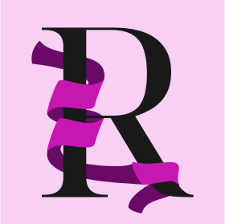

    
    <h3>Ribbon Language</h3>

 
 
 
 

An embeddable algebraic effects language with a focus on data polymorphism and allocator strategies, motivated by deep extensibility in the style of Lua/LISP

 
 
 

    <h3>WIP</h3>

